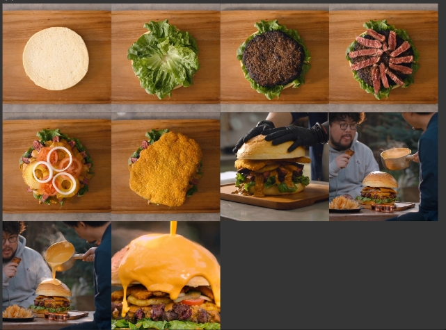
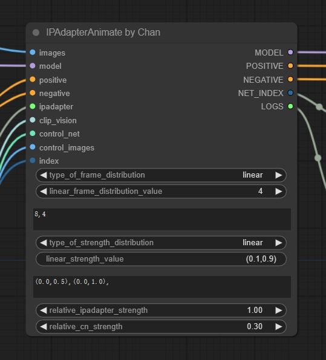

# ComfyUI-IPAnimate
- 这是一个基于IPAdapter+ControlNet逐帧生成视频的工作，与[Steerable-motion](https://github.com/banodoco/Steerable-Motion)不同，我们不依赖于AnimateDiff，这主要是考虑到当前AnimateDiff生成的视频较为模糊所决定的。通过IPAdapter+ControlNet的逐帧控制，使得我们可以生成更高清和可控的视频。

## 使用介绍
- 与[Steerable-motion](https://github.com/banodoco/Steerable-Motion)结构类似，我们提供了线性和动态两种控制方式，并且提供了外置ControlNet图片的输入，以提供更多的可玩性。

- 主要参数：
    - 变化帧长度
    - 影响强度范围
    - 相对IPA和CN的影响力度
- 具体工作流请参考：[demo](./demo/IPAnimate-demo.json)

## 参考来源
- [Steerable-motion](https://github.com/banodoco/Steerable-Motion)
- [Kosinkadink's ComfyUI-Advanced-ControlNet](https://github.com/Kosinkadink/ComfyUI-Advanced-ControlNet)
- [IPAdapter_plus](https://github.com/cubiq/ComfyUI_IPAdapter_plus)
